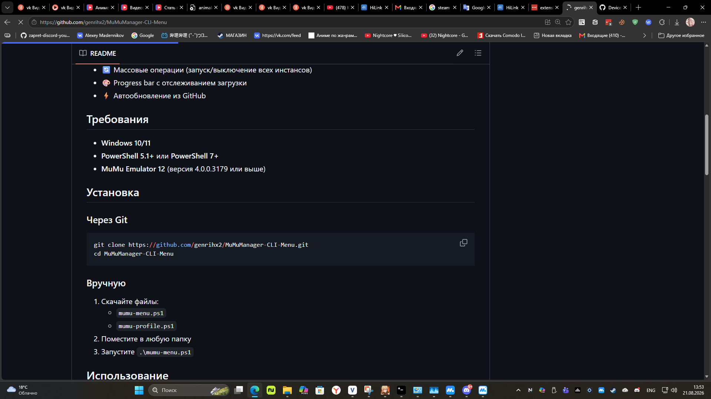

# MuMu Manager CLI Menu

Интерактивное PowerShell-меню для управления MuMu Emulator 12.

## Возможности

- 🚀 Запуск, выключение, перезагрузка эмулятора
- 📦 Установка и удаление приложений (APK)
- 📱 ADB-команды
- 🔄 Массовые операции (запуск/выключение всех инстансов)
- 🎨 Progress bar с отслеживанием загрузки
- ⚡ Автообновление из GitHub

## Требования

- **Windows 10/11**
- **PowerShell 5.1+** или **PowerShell 7+**
- **MuMu Emulator 12** (версия 4.0.0.3179 или выше)

## Установка

### Через Git
```powershell
git clone https://github.com/genrihx2/MuMuManager-CLI-Menu.git
cd MuMuManager-CLI-Menu
```

### Вручную
1. Скачайте файлы:
   - `mumu-menu.ps1`
   - `mumu-profile.ps1`
2. Поместите в любую папку
3. Запустите `.\mumu-menu.ps1`

## Скриншоты

### Главное меню


### Запуск эмулятора с progress bar
```
Launching instance 0...
current select player index: 0
player launch: result=0

  [#-----------------------------]  2% [ 3s]  state: starting_vm
  [##----------------------------]  5% [ 6s]  state: starting_rom
  [###---------------------------] 10% [12s]  state: starting_rom
  [####--------------------------] 12% [15s]  state: starting_rom
  [##############################] 100% Emulator is running! (booted in ~20s)
```

### Массовый запуск
```
Found 3 instance(s)
  [0] Android Device - launching...
  [1] Game Phone - launching...
  [2] Test Device - launching...

All instances launched. Polling boot status...
  [5 s] still booting...
  [10 s] still booting...
  All instances ready in ~15s!
```

## Как добавить реальные скриншоты

### Способ 1: Быстрый скриншот
1. Запустите `\mumu-menu.ps1` в PowerShell
2. Нажмите **Win + Shift + S** (область экрана)
3. Выделите окно консоли
4. Сохраните в папку `screenshots/`

### Способ 2: Скриншот через PowerShell
```powershell
# Запустите меню и сделайте скриншот программы
Add-Type -AssemblyName System.Windows.Forms
[System.Windows.Forms.Screen]::PrimaryScreen | ForEach-Object {
    $bmp = New-Object System.Drawing.Bitmap($_.Bounds.Width, $_.Bounds.Height)
    $gfx = [System.Drawing.Graphics]::FromImage($bmp)
    $gfx.CopyFromScreen($_.Bounds.Location, [System.Drawing.Point]::Empty, $_.Bounds.Size)
    $bmp.Save "$PWD\screenshots\menu-screenshot.png"
    $gfx.Dispose()
    $bmp.Dispose()
}
Write-Host "Screenshot saved to screenshots/menu-screenshot.png"
```

### Способ 3: Через ShareX или Lightshot
1. Установите [ShareX](https://getsharex.com/) или [Lightshot](https://app.prntscr.com/)
2. Настройте горячую клавишу
3. Сделайте скриншот и сохраните в `screenshots/`

### Именование файлов
```
screenshots/
  menu-main.png          # Главное меню
  menu-launch.png        # Запуск эмулятора
  menu-progress.png      # Progress bar
  menu-batch.png         # Массовые операции
  menu-settings.png      # Настройки
```

### Обновление README
После загрузки скриншотов обновите README:

```markdown
### Главное меню


### Запуск эмулятора

```

## Использование

### Запуск меню
```powershell
.\mumu-menu.ps1
```

### Меню опций
```
======================================
    MuMuManager CLI Menu
======================================

  --- Emulator Control ---
  [1] Show emulator info
  [2] Launch emulator
  [3] Shutdown emulator
  [4] Restart emulator
  [5] Create new emulator

  --- Apps and Settings ---
  [6] List installed apps
  [7] Show settings
  [8] Install APK
  [9] Uninstall app

  --- Batch ---
  [B] Launch all instances
  [D] Shutdown all instances
  [R] Restart all instances

  --- Other ---
  [A] Run ADB command
  [U] Check for updates
  [0] Exit
```

### Примеры

#### Запуск эмулятора
```
Select option: 2
Select instance to launch: 0
Launching instance 0...
  [#-----------------------------]  2% [ 3s]  state: starting_vm
  [##----------------------------]  5% [ 6s]  state: starting_rom
  [##############################] 100% Emulator is running! (booted in ~20s)
```

#### Массовый запуск
```
Select option: B
Found 3 instance(s)
  [0] Android Device - launching...
  [1] Game Phone - launching...
  [2] Test Device - launching...

All instances launched. Polling boot status...
  [5 s] still booting...
  [10 s] still booting...
  All instances ready in ~15s!
```

## Путь к MuMuManager.exe

По умолчанию скрипт ищет:
```
C:\Program Files\Netease\MuMuPlayer\nx_main\MuMuManager.exe
```

Если MuMu установлен в другое место, измените переменную `$MumuPath` в начале файла `mumu-menu.ps1`.

## Автообновление

При каждом запуске скрипт проверяет GitHub на наличие обновлений:
- Если версия актуальна — тихо продолжает работу
- Если есть обновление — спрашивает подтверждение
- Скачивает обновлённые файлы и перезапускается

Также можно проверить обновления вручную через опцию `[U]` в меню.

## Компоненты

| Файл | Описание |
|------|----------|
| `mumu-menu.ps1` | Основной скрипт с интерактивным меню |
| `mumu-profile.ps1` | PowerShell-профиль (опционально) |
| `SKILL.md` | Документация навыка для AI-агентов |

## Лицензия

MIT License

## Автор

[genrihx2](https://github.com/genrihx2)
